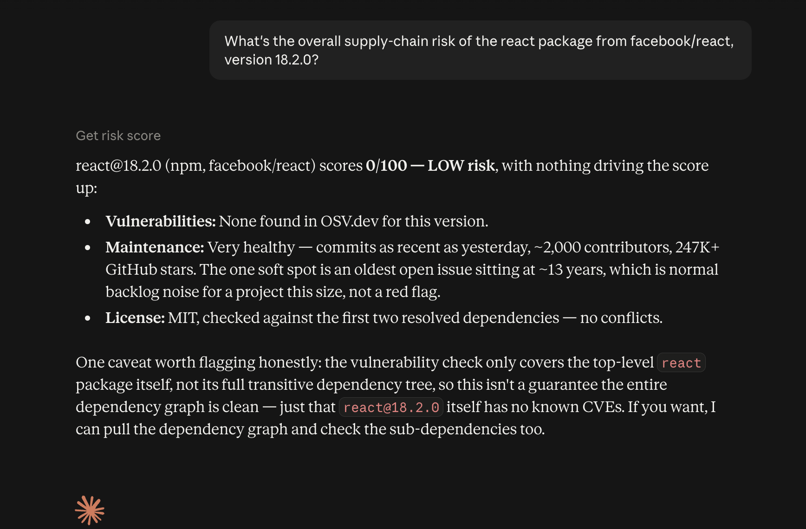
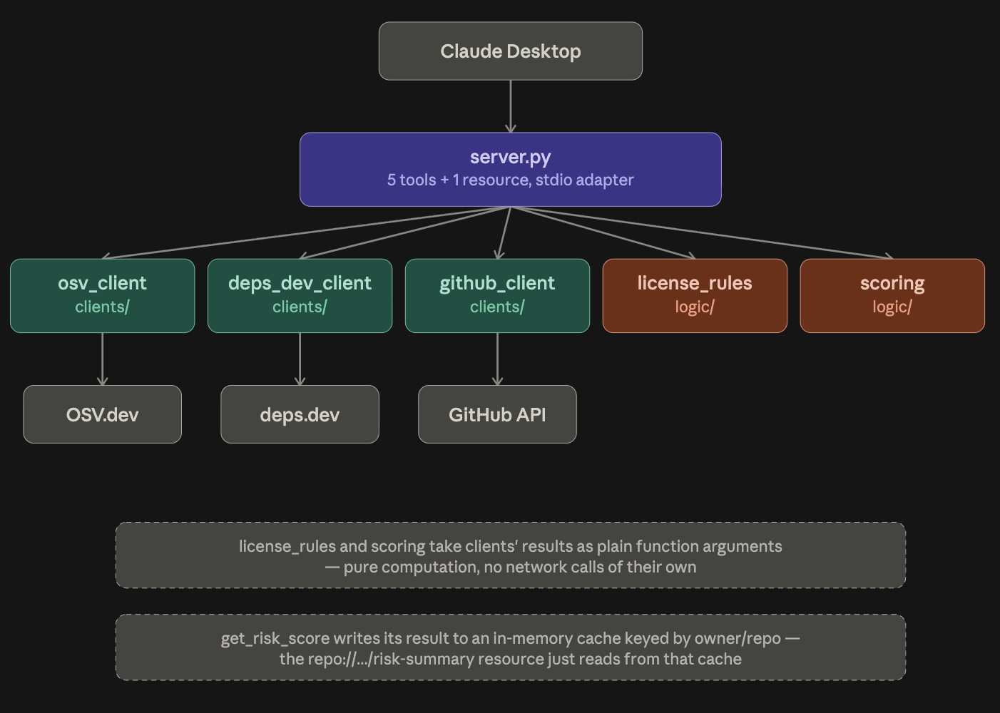
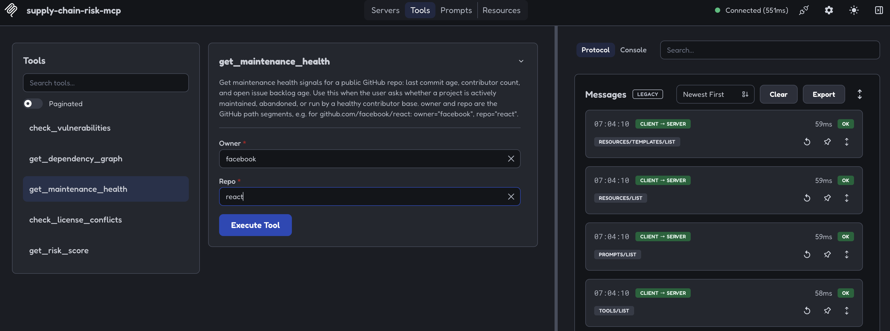
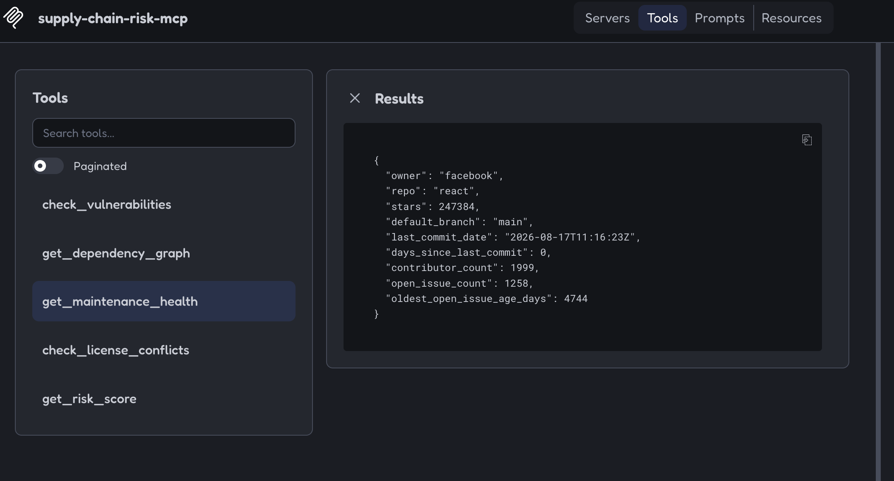

# supply-chain-risk-mcp

An MCP (Model Context Protocol) server that assesses open-source dependency risk — known CVEs, license conflicts, and maintenance health — for any public npm/PyPI/Cargo/Maven package and GitHub repo. Built entirely on free, no-auth-required public data sources: [OSV.dev](https://osv.dev), [deps.dev](https://deps.dev) (Google), and the GitHub public API.

Ask Claude a question like *"What's the dependency risk of the react package from facebook/react?"* and it queries live data, combines it into a scored, explained answer — not a guess from training data.



## Why this exists

Dependency risk — outdated packages, unpatched CVEs, incompatible licenses, abandoned maintainers — is a constant, real pain point in production engineering orgs, and almost nobody builds AI tooling around it despite that. This project demonstrates real domain logic (CVE severity handling, license compatibility heuristics, maintenance-health scoring) wired into the MCP standard, not just an API-wrapper tutorial clone.

## Architecture



```
You → Claude Desktop → this MCP server (stdio) → OSV.dev / deps.dev / GitHub API
```

- **Transport:** stdio — Claude Desktop spawns this server as a local subprocess, no network port
- **`clients/`** (teal) fetch from external APIs, zero MCP imports, fully unit-tested against mocked HTTP responses
- **`logic/`** (coral) does pure computation on data the clients already fetched — no network calls of its own, which is why `license_rules` and `scoring` are the easiest modules in this repo to unit test
- **`server.py`** (purple) is a thin adapter layer wrapping both layers in typed MCP tools — see [Tools](#tools) below
- Dashed arrows show data flow between modules (function arguments), not network calls — only the solid arrows into the gray API cylinders represent actual HTTP requests

See [`SCORING.md`](./SCORING.md) for the full risk-scoring methodology and the reasoning behind it — that's the part of this project that reflects actual engineering judgment, not just API plumbing.

## Tools

| Tool | Description |
|---|---|
| `check_vulnerabilities(package_name, ecosystem, version?)` | Known CVEs for a package via OSV.dev |
| `get_dependency_graph(package_name, ecosystem, version)` | Resolved dependency tree via deps.dev (npm, Cargo, Maven, PyPI only) |
| `get_maintenance_health(owner, repo)` | Last commit age, contributor count, open issue backlog via GitHub |
| `check_license_conflicts(project_license, package_name, ecosystem, version)` | Heuristic SPDX-based license conflict check (first 25 resolved dependencies) |
| `get_risk_score(owner, repo, package_name, ecosystem, version, project_license?)` | Composite 0–100 risk score combining all of the above, with an explanation of what drove it |

## Resource

`repo://{owner}/{repo}/risk-summary` — returns the cached result of the most recent `get_risk_score` call for that repo. In-memory only (resets on server restart); returns a clear "not yet checked" message if nothing has been cached for that repo.

## Setup

```bash
git clone <your-repo-url>
cd supply-chain-risk-mcp

python3 -m venv .venv
source .venv/bin/activate        # Windows: .venv\Scripts\activate

pip install -e . # assumes your pyproject.toml is valid and complete
```

No API keys required to run. Optionally, copy `.env.example` to `.env` and add a [GitHub personal access token](https://github.com/settings/personal-access-tokens/new) for a higher GitHub API rate limit (5,000/hr vs. 60/hr unauthenticated) — OSV.dev and deps.dev need no auth at all.

### Connect to Claude Desktop

1. Open Claude Desktop → Settings → Developer → Edit Config
2. Add this under `mcpServers` (merge with any existing entries — don't replace the whole file):

```json
{
  "mcpServers": {
    "supply-chain-risk-mcp": {
      "command": "/absolute/path/to/supply-chain-risk-mcp/.venv/bin/python3",
      "args": ["/absolute/path/to/supply-chain-risk-mcp/server.py"],
      "env": {
        "GITHUB_TOKEN": "your_token_here"
      }
    }
  }
}
```

Use the *absolute* path to your venv's Python (find it with `which python3` while the venv is activated) — Claude Desktop launches with a minimal PATH, so a bare `python` command will fail. Omit the `env` block entirely if you're not using a GitHub token.

3. Fully quit and relaunch Claude Desktop
4. Confirm it's connected under Settings → Developer





## Testing without Claude Desktop

Use [MCP Inspector](https://github.com/modelcontextprotocol/inspector) to call tools directly and inspect raw request/response data:

```bash
npx @modelcontextprotocol/inspector python3 server.py
```

## Example conversations

**1. Vulnerability check**

> **You:** Are there any known vulnerabilities in the npm package lodash?
>
> **Claude:** *(calls `check_vulnerabilities`)* Yes — lodash has a history of disclosed vulnerabilities, including a critical prototype pollution issue (CVE-2019-10744) and several high/moderate findings related to prototype pollution, ReDoS, and code injection via `_.template`. Most are fixed as of lodash 4.17.21. If you tell me your installed version, I can check it against this list specifically.

**2. Composite risk score**

> **You:** What's the overall supply-chain risk of the react package from facebook/react, version 18.2.0?
>
> **Claude:** *(calls `get_risk_score`)* react@18.2.0 scores 0/100 — LOW risk. No known vulnerabilities for this version, very healthy maintenance (commits as recent as yesterday, ~2,000 contributors, 247K+ stars), and MIT license with no conflicts against its checked dependencies. Note: this covers the top-level package only, not the full transitive dependency tree — happy to check sub-dependencies too if you want.

**3. Graceful failure on an invalid package**

> **You:** Check vulnerabilities for a package called asdkjhaskdjh123 on npm
>
> **Claude:** *(calls `check_vulnerabilities`)* No vulnerabilities returned — but that's not the same as confirming it's safe. This doesn't look like a real, published npm package name, so the empty result most likely means OSV.dev has no record of it at all (possibly because it doesn't exist), not that it's been checked and found clean. Worth double-checking the exact package name on npmjs.com.

## Known limitations

- License conflict detection is a category-based heuristic (permissive / weak copyleft / strong copyleft), not a legal compatibility determination — see [`SCORING.md`](./SCORING.md) for details
- `get_dependency_graph` and `check_license_conflicts` require the package's ecosystem to be one of npm, Cargo, Maven, or PyPI (a deps.dev limitation, not ours)
- Vulnerability and license checks currently cover the top-level package/version specified, not the full recursively resolved transitive tree
- The `repo://.../risk-summary` resource cache is in-memory only and resets when the server restarts
- Risk-scoring weights are a reasoned heuristic, not empirically validated against real incident data (see `SCORING.md`)

## Project structure

```
supply-chain-risk-mcp/
├── server.py                   # MCP adapter layer — tools + resource
├── clients/                    # API wrappers, no MCP imports
│   ├── osv_client.py
│   ├── deps_dev_client.py
│   └── github_client.py
├── logic/                      # Pure domain logic, no MCP imports
│   ├── scoring.py
│   └── license_rules.py
├── tests/                      # pytest, fully mocked, no network calls
├── SCORING.md                  # Full risk-scoring methodology
└── docs/screenshots/           # Reference screenshots
```