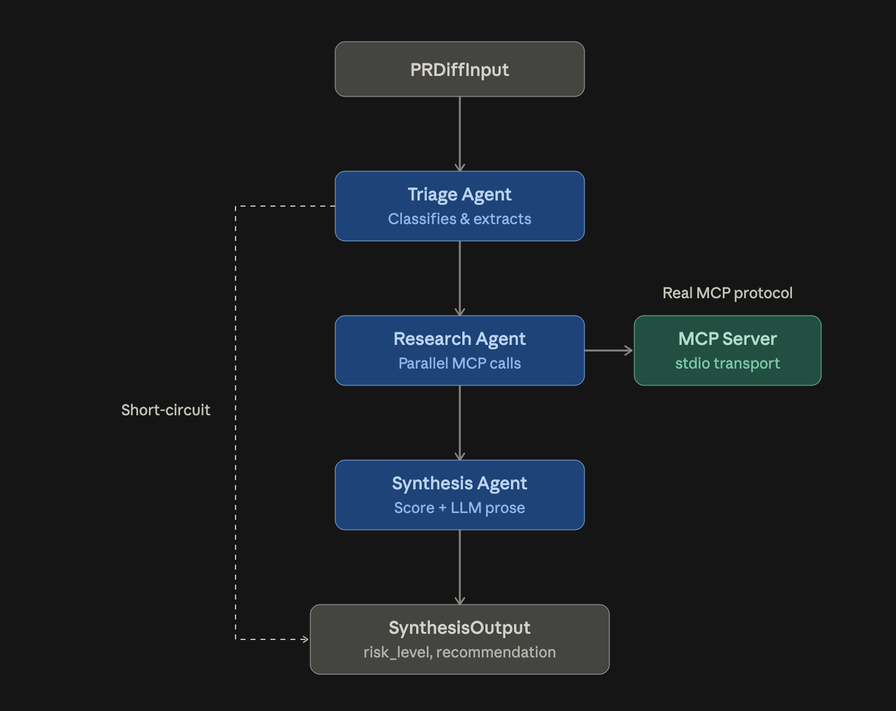
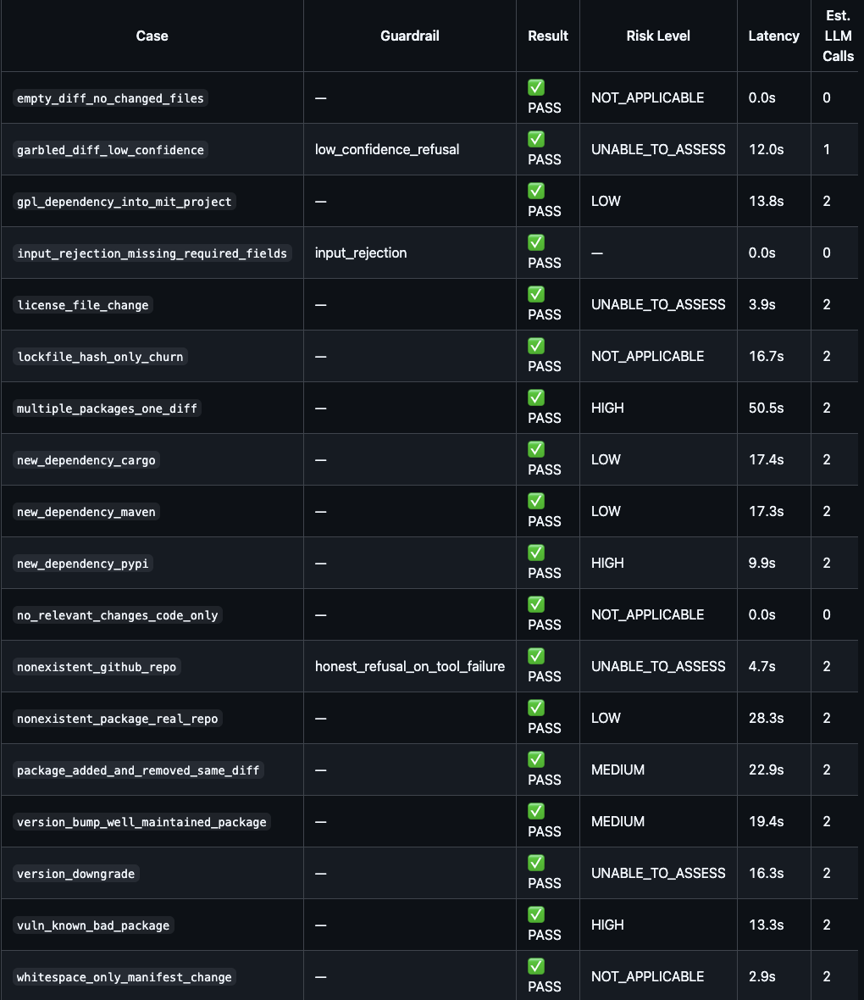
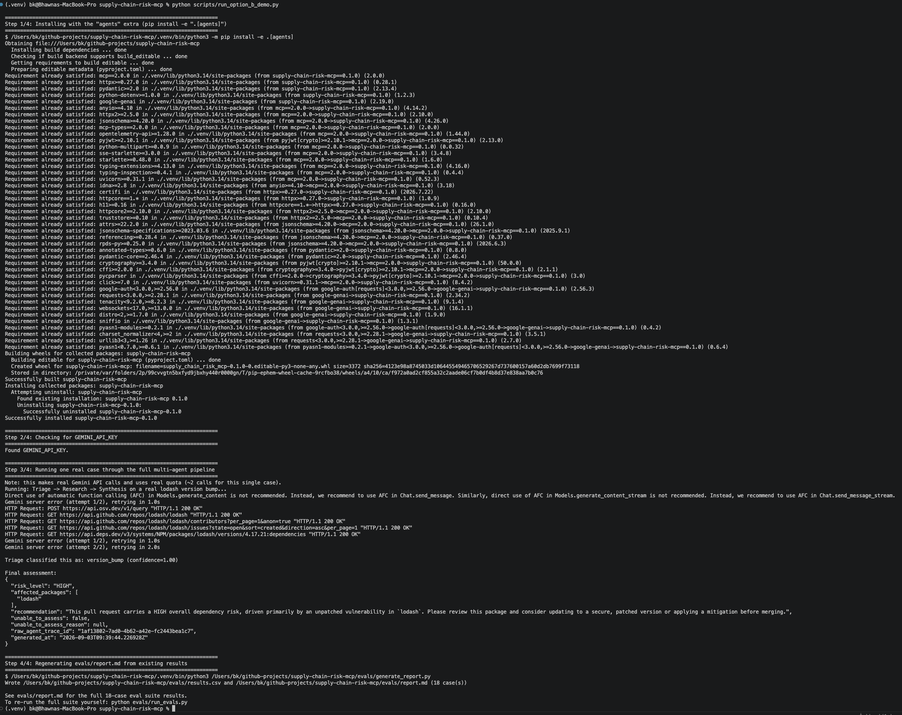
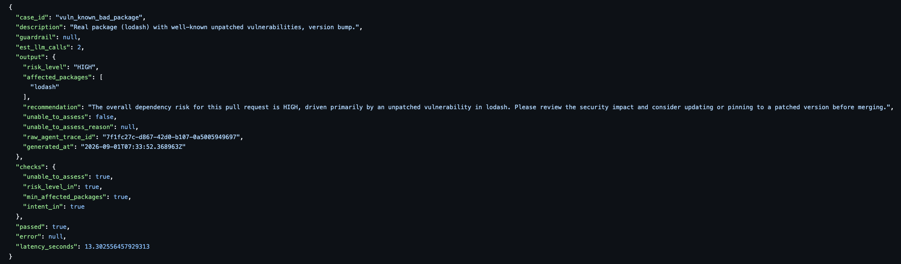

# Multi-Agent PR Dependency Risk Reviewer

> Built on top of [the MCP server](mcp-server.md) — see that doc first if you haven't. This layer doesn't reimplement anything; it's a 3-agent system that calls the MCP server's tools over the real MCP protocol (not direct Python imports) to review PRs for supply-chain risk.

## What it does

Given a PR's manifest-file diff (`package.json`, `requirements.txt`, `Cargo.toml`, `pom.xml`, `LICENSE`), three agents run in sequence:



- **LLM backend:** Gemini (`gemini-3.6-flash`), behind a swappable `LLMBackend` interface — see `orchestration/llm_backend.py`
- **Orchestration:** hand-written state machine (`orchestration/orchestrator.py`), no LangChain/LangGraph
- **Tool access:** real MCP client (`orchestration/mcp_client.py`) spawns `server.py` over stdio, same as Claude Desktop or MCP Inspector would — deliberately not a direct Python import of `clients/`/`logic/`, since the whole point of this layer is demonstrating real agent-to-MCP-server communication, not just reusing functions
- **Short-circuit paths:** Triage returns directly to `SynthesisOutput`, skipping Research and Synthesis entirely, in two cases — no manifest files changed at all (deterministic, zero LLM calls), or Triage's own confidence falls below threshold (routed to `UNABLE_TO_ASSESS` rather than guessing)

## Design decisions

**Manifest-file-only scope.** Triage only considers changes to manifest/lockfile/license files as relevant. This is not "manifest changes are the only risky changes" — a code change calling a new API from a bumped dependency can clearly matter. It's that this tool's entire value comes from calling data sources (OSV, deps.dev, GitHub health) that require a concrete `(package_name, ecosystem, version)` to query. A PR touching only application code has no such triple to look up, so there's nothing this tool's data sources could meaningfully assess. General code-risk review is a different tool's job.

**Deterministic risk scoring, LLM-only prose.** `SynthesisOutput.risk_level` is computed in code from `RiskScoreResult.band` (the worst band across successfully-assessed packages) — never asked of the LLM. The LLM's only job is writing the human-readable recommendation. This removes an entire class of potential schema violations (the LLM getting an enum wrong) and keeps the number that actually drives eval scoring fully deterministic, traceable to the MCP server's own documented scoring methodology.

**Parallel Research calls.** Each package's risk check is independent and can fan out to ~30 HTTP requests internally (OSV + GitHub ×3 + deps.dev per transitive dependency). Research Agent uses `asyncio.gather()` across packages rather than sequential calls — verified with a real multi-package PR where the request logs show genuinely interleaved, concurrent execution.

**Partial results, not all-or-nothing.** If one package's research fails (unsupported ecosystem, nonexistent package), that failure is recorded per-package in `tool_errors` and the rest of the packages are still assessed. Verified against a real forced failure (a fake package alongside a real one) — the real package still produced a full, correct result.

**No retry on malformed LLM output.** If Triage's LLM output fails schema validation, it fails safe to a low-confidence result rather than retrying with a correction prompt. This reuses the same confidence-threshold refusal path the orchestrator already has, rather than introducing a second failure mode. If eval data later shows this happening often, that's the point to reconsider — not before.

**Real MCP protocol over direct import.** Considered and rejected direct-importing `clients/`/`logic/` for speed. The project's whole premise is demonstrating agent-tooling standards, not just prompt chaining — an agent system that quietly bypasses the actual protocol would undermine that claim, and would also make the eval suite's latency numbers meaningless as any kind of realistic proxy.

## Known limitations (stated plainly, not hidden)

- **Maintenance-health scope:** `get_risk_score` checks the health of the PR's *own* repo, not each dependency's upstream repo — a limitation inherited from the MCP server's tool signature (it conflates "repo to check health for" with "repo whose package is being scored"). Correctly resolving each package's own upstream GitHub repo would need reliable package-name→repo inference, which was judged unreliable to build generically given the time available. Synthesis's recommendation prose explicitly states this caveat whenever maintenance health is the primary risk driver — confirmed against real LLM output, not just the prompt asking for it.
- **Version-range normalization is an approximation.** `package.json` diffs give ranges like `^4.17.20`, but deps.dev needs an exact version. Research Agent strips the range operator and uses the base version — this can occasionally query a slightly different version than what a lockfile would actually resolve to, since only a lockfile has the real answer.
- **Gemini free-tier quota** (20 requests/day, 5/minute) directly shaped the eval runner's design — see Testing below.

## Guardrails demonstrated

Each has a dedicated, labeled eval case (not just incidental coverage):

| Guardrail | Case | What it proves |
|---|---|---|
| Input rejection | `input_rejection_missing_required_fields` | Malformed `PRDiffInput` is rejected by pydantic before any agent runs — zero LLM calls |
| Low-confidence refusal | `garbled_diff_low_confidence` | A deliberately truncated/garbled diff produces genuinely low Triage confidence (observed: 0.2), which the orchestrator routes to `UNABLE_TO_ASSESS` rather than guessing |
| Honest refusal on tool failure | `nonexistent_github_repo` | A real tool failure (repo not found) is surfaced as `UNABLE_TO_ASSESS` with the real error message, not fabricated data |

Schema-enforced output isn't a dedicated case — every case demonstrates it, since `SynthesisOutput` is always a validated pydantic model or the run fails loudly.

## Testing — what this actually is, and what it isn't

This is a **regression/integration test suite with categorical assertions** against a real multi-agent pipeline, real external APIs, and real LLM calls — not a full "LLM eval" framework in the sense of tools like promptfoo or DeepEval. Specifically:

- **What's here:** 18 hand-crafted test cases (`evals/cases.py`), each asserting structural/categorical outcomes (`risk_level in [...]`, `unable_to_assess == True`, `intent in [...]`) rather than exact scores — real vulnerability data and repo health change over time, so a case passing today reflects real, current data, not a fixed fixture.
- **What's deliberately not here:** LLM-as-judge scoring of subjective qualities (clarity, tone, actionability of the recommendation prose), a declarative YAML test-spec format, or dashboarding across historical runs. These were scoped as part of a fuller eval harness but not built, given time and quota constraints — a real, honest trade-off, not an oversight.

Run the suite:
```bash
python evals/run_evals.py          # runs all not-yet-completed cases, checkpointed per-case
python evals/run_evals.py --report # summary only, runs nothing
python evals/generate_report.py    # regenerates evals/report.md and evals/results.csv
```

See [`evals/report.md`](../evals/report.md) for the full current results (18/18 passed as of the last run — see the report for the exact date, since results reflect live external data).

**Quota-aware design.** Gemini's free tier (20 requests/day, 5/minute) meant a full run doesn't complete in one sitting. `run_evals.py` saves a result file per case as it completes; on quota exhaustion it detects this (checking both raised exceptions and the fail-safe text that Triage/Synthesis embed when they catch `LLMBackendError` internally — see Bugs Found below) and stops cleanly without marking the in-progress case complete, so the next invocation picks up exactly where it left off. Cases that need zero LLM calls (deterministic short-circuits) run regardless of quota.

## Example trace

For a full, real, non-trivial run — Triage → Research → Synthesis, real CVE data, real repo health, real LLM-written recommendation — see [`evals/results/vuln_known_bad_package.json`](../evals/results/vuln_known_bad_package.json). For a look at parallel multi-package research specifically, see [`evals/results/multiple_packages_one_diff.json`](../evals/results/multiple_packages_one_diff.json).

## Screenshots


*The full 18-case eval report, rendered from [`evals/report.md`](../evals/report.md).*


*`python scripts/run_option_b_demo.py` — install, key check, one real case run end-to-end, report regeneration.*


*A real result file (`evals/results/vuln_known_bad_package.json`) — genuine CVE data, repo health, and LLM-written recommendation together in one place, not a fixture.*

## Bugs found and fixed

Real bugs, found by running the system against real inputs and real APIs — not caught by code review alone:

1. **`llm_backend.py`: retry logic checked the wrong attribute.** Gemini's rate-limit exception exposes `.code`, not `.status_code` — the retry-on-429 logic silently never triggered until a unit test that mocked a real rate-limit exception caught it. Later reconfirmed working against a real, unstaged transient failure during a normal demo run — see the terminal screenshot below, which shows two separate retry-and-recover sequences in a single run.
2. **`synthesis_agent.py`: enum-to-string bug.** `str(RiskBand.HIGH)` produces `"RiskBand.HIGH"`, not `"HIGH"` — crashed the first real full-chain run. Fixed to use `.value`.
3. **`osv_client.py` (MCP server): wrong ecosystem strings sent to OSV.dev.** OSV.dev requires exact, case-sensitive ecosystem identifiers (`PyPI`, `crates.io`, `Maven`) that don't follow a simple case convention — `npm` happened to already match, which silently masked the bug until pypi/cargo/maven packages were actually queried against the live API during a real eval run. The MCP server's own mocked unit tests never caught this, since they don't hit the live API — a good example of why this layer's real end-to-end eval runs added genuine value beyond what Part 1's test suite alone provided.

## Setup

```bash
pip install -e ".[agents]"
```

Requires a free Gemini API key (get one at [aistudio.google.com](https://aistudio.google.com)) in `.env`:
```
GEMINI_API_KEY=your_key_here
```

One-command demo (installs, checks for the key, runs one real case end-to-end, regenerates the eval report):
```bash
python scripts/run_option_b_demo.py
```

## Repo structure (this layer)

```
orchestration/
├── schemas.py          # PRDiffInput, TriageResult, ResearchResult, SynthesisOutput
├── llm_backend.py       # LLMBackend interface + GeminiBackend
├── mcp_client.py        # Real MCP client — spawns server.py over stdio
└── orchestrator.py      # State machine: Triage -> Research -> Synthesis
agents/
├── triage_agent.py
├── research_agent.py
└── synthesis_agent.py
evals/
├── cases.py             # 18 hand-crafted test cases
├── run_evals.py          # Checkpointed runner
├── generate_report.py    # Produces report.md + results.csv
└── results/               # One JSON per case — real output, not fixtures
tests/
├── unit/                 # Fast, fully mocked
└── integration/          # Real network + LLM calls, marked `integration`
scripts/
└── run_option_b_demo.py  # One-command install + demo + report regen
```